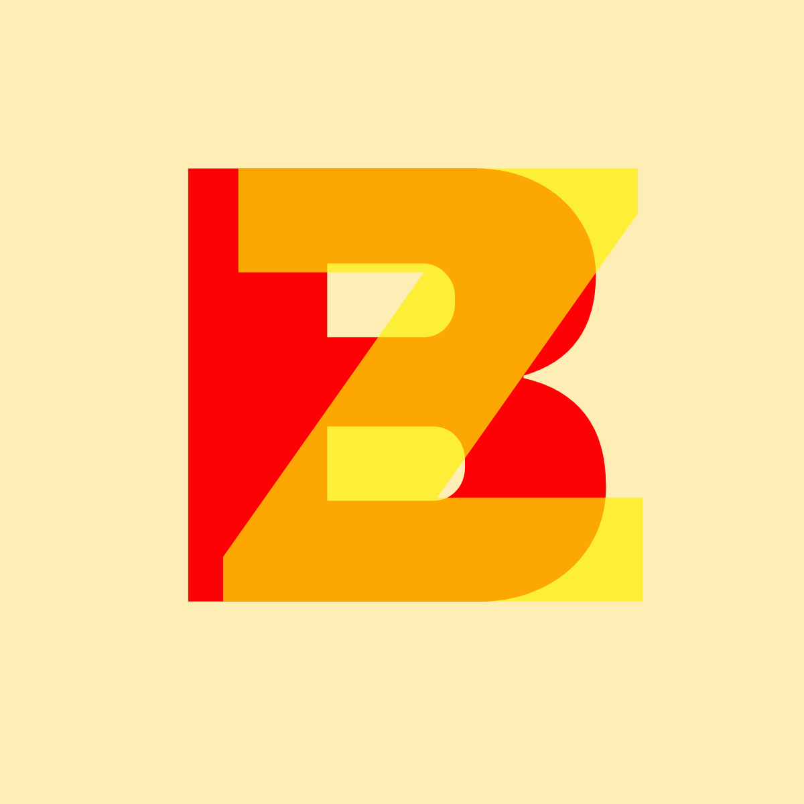
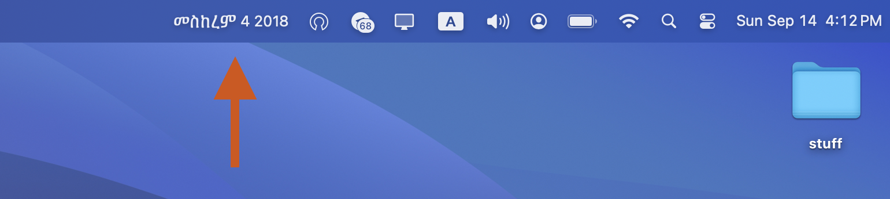
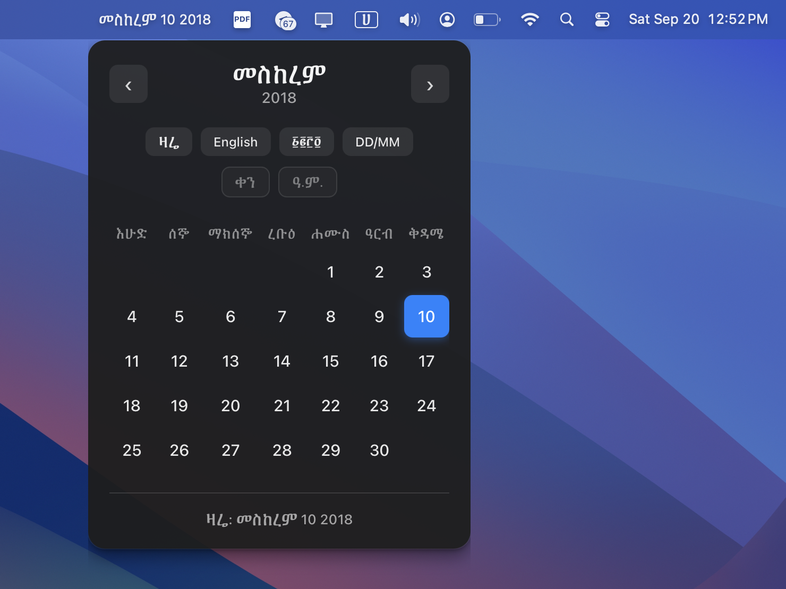

# ZemenBar


ZemenBar is a lightweight macOS menu bar app that shows today’s Ethiopian date in the tray. A compact, tooltip-style window lets you choose language (English / አማርኛ) and numerals (Arabic / ግዕዝ). Built with Tauri (Rust) and SvelteKit.

## Screenshots





## Credits and inspiration

This project is inspired by [EthCal](https://github.com/dagimg-dot/EthCal) by [dagim-dot](https://github.com/dagimg-dot) on GitHub. ZemenBar is an opinionated macOS implementation of [EthCal](https://github.com/dagimg-dot/EthCal).

ZemenBar uses the excellent [ethiopic-calendar](https://crates.io/crates/ethiopic-calendar) crate by [Frectonz](https://github.com/frectonz). If you want a CLI calendar, check out [Me-ku-te-rya](https://github.com/frectonz/mek-ut-er-ya).

## Features
- Ethiopian date in the macOS menu bar (auto-refreshed hourly)
- Compact vs. full tray text depending on available width
- Click the tray text to open a calendar window with a settings panel
- Full calendar view with current month display
- Copy current date to clipboard with one click
- Smart window positioning (adapts to screen edges and DPI scaling - this one was a pain in the ass)
- Options:
  - Language: English or አማርኛ
  - Numerals: Arabic or ግዕዝ (Ge’ez)
  - Numeric format toggle (DD/MM/YYYY vs. text format)
  - Qen suffix toggle (ቀን) for Amharic dates
  - Amete Mihret suffix toggle (ዓ.ም.) for Amharic years
- Settings are persisted between launches
- Autostart and single-instance behavior on macOS
- Dark mode support with system theme detection

## Roadmap / Planned features
- Google Calendar integration (show events; read-only initially)
- Public holidays and other indicators (Ethiopian holidays or other; configurable)

Contributions are welcome!

## Getting started

### Prerequisites
- Rust toolchain (rustup, cargo)
- Node.js 18+ and pnpm
- Mac (primary target for tray behavior tested so far on a 2023 MacBook Pro M3 with Sequoia 15.5, need help testing on more OSes and more Mac models since I'm not sure how well it works on older Macs and different screen sizes)

### Install
```sh
pnpm install
```

### Run in development
This starts the SvelteKit dev server and launches Tauri.
```sh
pnpm dev   # in one terminal
# then, in another terminal
cargo tauri dev
```

Alternatively, Tauri is configured to run `pnpm dev` automatically in dev mode.

### Build release
```sh
pnpm build
cargo tauri build
```
The frontend build output is served from `build/` (configured in `src-tauri/tauri.conf.json`).

## Contributing
Contributions are welcome!
- Fork the repo and create a feature branch.
- Keep the UI minimal and accessible; follow the existing style and naming.
- Keep the rust code minimal and easy to read. Avoid external dependencies if possible.
- Prefer small, focused PRs.

Before submitting a PR:
- Run `pnpm build` to ensure the Svelte UI builds.
- Run `cargo tauri dev` to ensure the app works fine.
- Run `cargo check` and `cargo clippy -W clippy::all` to verify the Rust side.
- Manually smoke-test the tray behavior (click to open/close, focus-away to hide, settings persist, tray updates and also make sure to test the behaviour when an external screen is connected).

### Code style and guidelines
- Rust: Still learning, for now I have no preferences other than to keep it simple, legible and concise.
- Svelte: keep the settings panel simple; minimize global styles;
- Logging: keep logs minimal and useful; avoid noisy debug prints.

## License
This project is licensed under the Mozilla Public License 2.0 (MPL-2.0). This license requires that any modifications or derivative works that include this code must also be made available under the same license, ensuring proper attribution and that improvements benefit the community.

See the [LICENSE](LICENSE) file for details.
